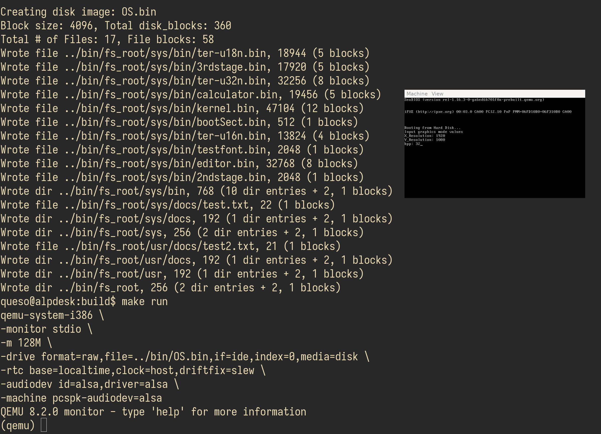
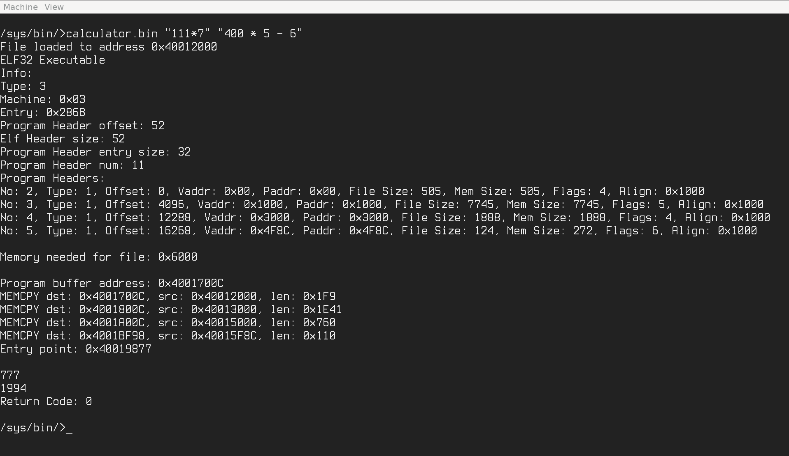
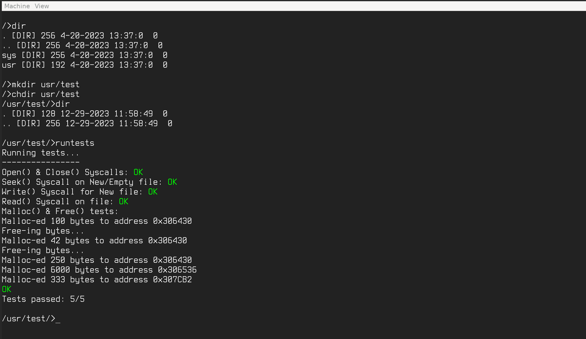
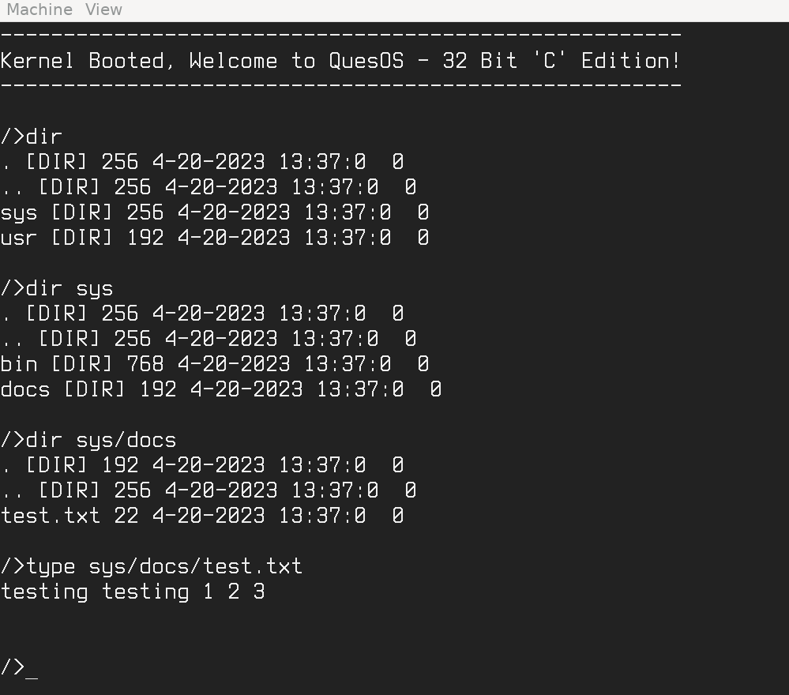
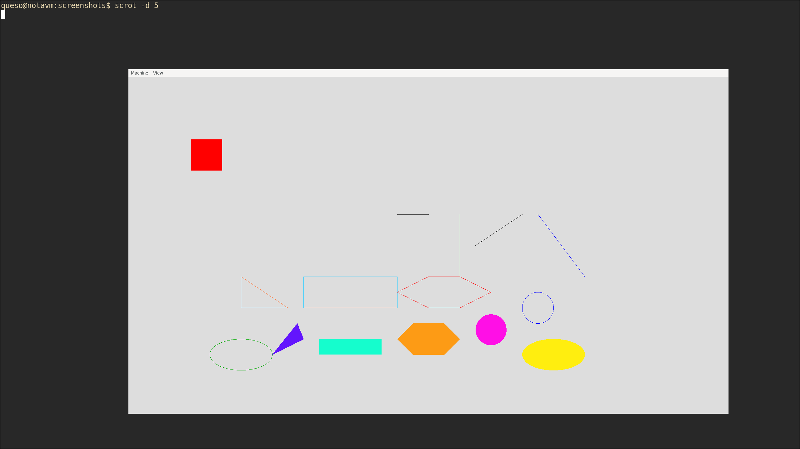

Overview/Goals:
---
* Homemade x86(_64?) operating system, as from scratch as possible, more over time. Currently 32bit protected mode using legacy boot, but will eventually try 64bit long mode and UEFI. 
The current medium-term goal is to develop the OS from within itself, editing its own source files using a homemade toolchain: editor, assembler, compiler, programming language(s), etc. Will later try to include 
GUIs, applications, window managers, and other things. Planning on hardware support for (at minimum? at most?) a thinkpad x60, if possible. If reached, then a 2019 dell xps, or maybe a desktop PC.
Currently runs in qemu and bochs. 
The main goal is learning from a bottom-up perspective, and doing everything homemade, originally starting from a 512byte empty bootsector. Little to no external dependencies needed, other than a recent
C compiler, an x86 assembler, and make. And an emulator for testing/developing. I assume a linux/unix environment for building, and do not (yet) provide any pre-built binaries/ISOs.

* Initial reasoning & motivation for this project was to learn x86 16 bit real mode assembly; This is mostly done, as it's now developed in C with spatterings of standalone and inline asm.
However, if/when it's fun or interesting, I'll still develop some things in assembly.

* The other main reason was to learn OS development and systems programming as a newbie with no prior knowledge and no formal CS education. I'm interested in from-scratch tools and
programming, and in an ideal world with enough time I could have a full computer with self-made hardware/software stack, from transistors to internet browser and games, as 
simple as possible, for 1 person to maintain.
  This OS is an attempt to start that, and could grow into other non-OS areas over time. It's also an attempt to get better at explaining my
thought processes and how I work through things, and improving my speaking in general, through development videos. 
I'm learning bits of computer science from slowly going through MIT lectures and various books, so hopefully the code and knowledge improves tangibly over time.
This is my largest personal project and learning/research experience so far, and I'm a newbie trying to make something that will take a
long time for his own self-interest. It might look simple, amateurish, and incomplete. Because it is! Keep that in mind [|:^) 

* Feel free to fork or make your own changes to your own repos, the license is effectively public domain (0-clause BSD license). Suggestions or improvements are welcome, and will be covered 
in a video if used (and will credit you, if I remember and you don't say otherwise). I might open up this repo to the public in the future, but currently lack 
sufficient time to manage that, and would rather work on things solo for now.

Project Structure:
---
* /bin: intermediate binary files during the build process, the final `OS.bin` binary, and the initial file tree under `bin/fs_root`. 
* /build: linker scripts for C source files, a makefile to build the project, and other supporting programs/scripts/files used for building.
* /include: subdirectories containing header/source files to be included in the main /src files. These are mainly .h C files, without .c counterparts, with all the code in the "header". It mostly works ok.
* /src: the main source files used to build the intermediate binary files and final OS.bin file.

Current Standing:
---
* In general: 32 bit protected mode, all ring 0. Virtual memory & paging, no multitasking/multiprocess (yet). May stick to ring 0 only when/if that's set up, not sure yet.
* Initial interrupt support for exceptions, system calls (using int 0x80), regular software interrupts, and the PIC. PIC IRQs 0 & 8 are implemented for PIT channel 0 (at a default rate of ~1000hz for sleep() syscalls) and CMOS Real time clock (at a default rate of 1024hz). 
IRQ1 for keyboard handling, but only a subset of scancode set 1. Currently keystrokes are retrieved from the PS/2 data port 0x60 in a busy loop. You should be able to add your own interrups as desired. 
* Vesa Bios Extensions for graphics modes. On boot you type in desired X resolution, Y resolution, and bits per pixel values, or take a default of 1920x1080 32bpp. 
If trying to run on actual hardware, ensure you know what your hardware supports! Trying to run unsupported modes may damage your hardware!!
* "Generic" bitmap font support for bdf fonts. Add a bdf font to /src/fonts, add the font file with '.asm' extension to the file list in /build/make_disk.c, and use 'chgfont ' at OS shell when booted.
* Barely functioning text/hex editor for 512 byte length files, and a 4 function calculator. More/other programs to come in the future.
* Ability to save and load text or binary (hex) files. Valid x86 binary files can be run from the hex editor if the file length is <= 1 sector, or from the main kernel command line if set up in the file table.
Binary files written in the hex editor are auto-ended with a '0xCB', or far return. That probably doesn't work, and will change when better memory management and program loading is developed.
* Several commands available for the in-built kernel "shell" such as del, ren, chgcolors, chgfont, etc. A list of available commands is in the kernel.c source, in kernel_main(), where
they're prefixed with "cmd*". Eventually there will be a "help" command or similar to list available commands and descriptions at runtime.

How to Build/Run:
---
* Disclaimer: Mainly tested on (previously) 64 bit OpenBSD, FreeBSD, and (currently) Alpine Linux. Not guaranteeing any other platforms will work for building.

* Dependencies:
    * Emulator: bochs http://bochs.sourceforge.net/ and/or qemu https://www.qemu.org/download/ 
    * make 
    * x86 Assembler: netwide assembler https://www.nasm.us
    * C compiler: clang or gcc. Most versions with C17 support should work, but there could be some different warnings/errors between versions and OSes/platforms/etc.

* Building:
    * clone and cd to this repo's /build folder
    * Run 'make OS' or 'make' from the command line to build the OS.bin binary in /bin

* Running:
    * qemu: In the /build folder, run 'make run'
    * bochs: In the /build folder, run 'make bochs'
 
Note: Qemu seems to run and act better than bochs, so I use it for the most part, with limited testing in bochs for accuracy/stability. If anything is broken on bochs please let me know. 
Also let me know of any ways to simplify the build process/makefile, or how to make the OS more portable for other environments (Windows, POSIX utilities or compliance, etc.)

TODO (There's ALWAYS more to do e.g. lots of TODOs in the source files):
---
See the `ToDos.txt` file for a mostly up-to-date list.

Videos / Documenting Progress:
---
All progress, or every new/changed line of code (as possible and needed), will be documented on 
video in a youtube playlist on my main channel:
https://www.youtube.com/playlist?list=PLT7NbkyNWaqajsw8Xh7SP9KJwjfpP8TNX

* All development is currently done on "live" recordings, and is probably arduous or boring for 
most people to watch. Footage is edited down to cut out long pauses, gratuitous ums and ahs, 
redundant info, off-topic ramblings, mouth noises/clicks, and more.

_Suggestions or comments regarding videos can be made in the video comments, twitter @Queso_Fuego, 
or email fuegoqueso@gmail.com_

* The rollout of these videos will probably be slow (weeks to months between videos). 
I have a full time job and lack the time/energy/motivation most days to do much work outside of 
reading, research, and light testing. However, I will respond to messages sent by Youtube video 
comments/twitter/email, and I greatly appreciate all those who wait and watch.

Tools used for these videos:
* recording: OBS Studio
* video editor: Davinci Resolve
* OS: Recording and development is done on Alpine Linux, editing is done on Windows 11 Enterprise 
as Davinci Resolve isn't available on Alpine, and I've had issues with Kdenlive and other editors.
* microphone: Shure SM7B, Cloudlifter CL-1, Focusrite Scarlett Solo
* camera: Sony ZV-1, Elgato Camlink 4k
* mouse: Logitech M590 or Logitech G502
* keyboard: HHKB professional hybrid type S

Development:
---
Currently, this OS is developed with: 
* 64 bit Alpine Linux, dual booted with Windows 11
* neovim 
* qemu emulator (sometimes bochs)
* nasm assembler (may switch to full clang/gcc 'as' assembly in the future to not need this)

This may change later on if I fully develop the OS within itself; that is, running the OS binary 
and editing that binary during runtime from within itself, using the OS's own editors, languages, 
and toolchains.
In this event, changes to the binary would still be uploaded to this repo or others as time and 
space allows, but relevant changes would not necessarily be seen in source files. I'm assuming 
only the binary file would be changing at that point. So I may take a different approach at that 
time to better document changes.

Screenshots:
---

These are probably way out of date and different screenshots will be used in the future.
